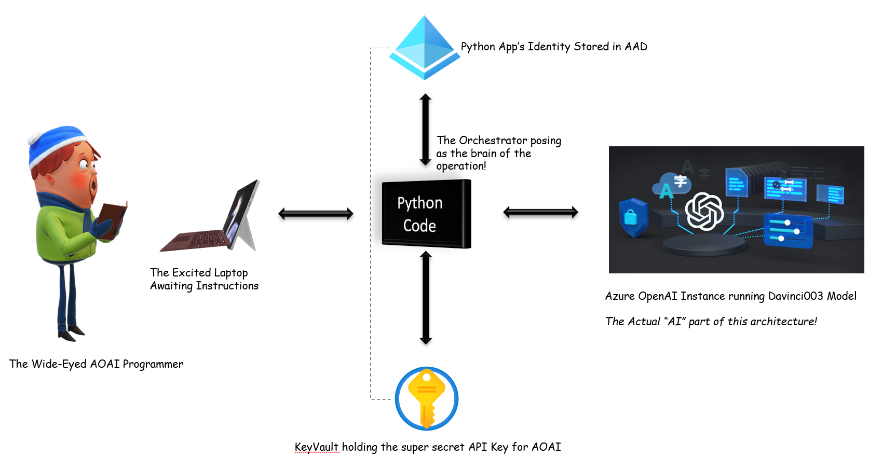

# Python - Azure OpenAI Demo
This has two python demos. These demos do not claim to solve world hunger or climate crisis. They are just technology demos that show how a python programme can call an Azure OpenAI API to get the response. Feel free to fork this repo and build on them. 

## Demos
1. "Create an automated email response" based on data entered by the user.
2. "Summarize a small text file" - Renter Reform Act in the UK as an example.

## Architecture
Python code authenticates itself in Azure Active Directory through an App Registration. 
Azure OpenAI API Key is stored in Azure Key Vault.



You need to set the following environment variables before you run the python code.

```
export AZURE_TENANT_ID=<Your Tenant ID - from AAD App Registration>
export AZURE_CLIENT_ID=<Client ID from App Registration>
export AZURE_CLIENT_SECRET=<Client secret from App Registration> 
export AZURE_SUBSCRIPTION_ID=<Your Azure Subscription ID>

```
Note: This implementation assumes that your Azure Key Vault is in the same subscription. 

Also, make sure that all the libraries are installed in your environment. For instance,
```
pip install openai
```
I used Github Codespaces to run these demos and it works really well. If you do not have Python installed locally, you can explore this option. 
